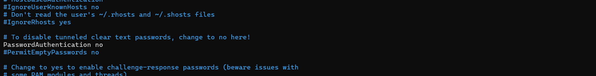
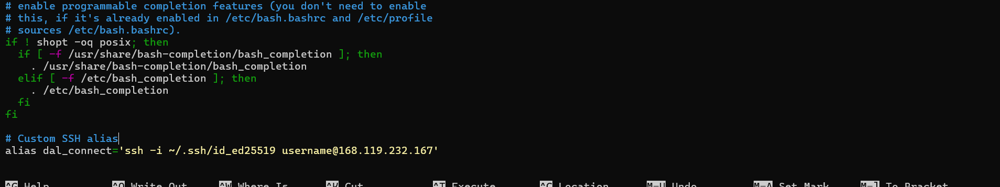
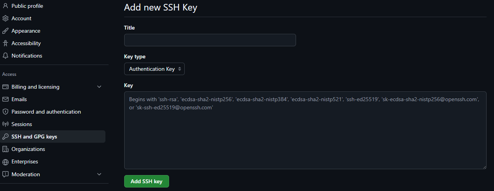

# 🔐 Secure V-Server Setup

This guide explains how to securely set up a V-Server — including SSH key authentication, user management, disabling password logins, and configuring an Nginx web server.  
Ideal for beginners and for anyone who needs to repeatedly configure servers securely.


## Features
- Create SSH key & disable password login
- Create user with sudo privileges
- Install Nginx & host custom HTML page
- Alias commands for quick access

## 📚 Table of Contents
- [Features](#features)
- [Establish SSH Connection](#establish-ssh-connection)
- [Web Server (Nginx)](#open-web-server-in-browser-nginx)
- [Create Aliases](#create-alias-shortcuts-on-linux)
- [Connect V-Server with GitHub](#connect-v-server-with-github)

<br>  

## Establish SSH Connection

### 1. Create Local SSH Key
```bash
ssh-keygen -t ed25519 
```

### 2. Connect to V-Server
```bash
ssh root@SERVER-IP
```


### 3. Create New User
```bash
adduser username
usermod -aG sudo username
mkdir -p /home/username/.ssh
chmod 700 /home/username/.ssh
chown -R username:username /home/username/.ssh
```

### 4. Copy Local SSH Key to V-Server on Windows 
```bash
type C:\Users\username\.ssh\developerAkademie\id_ed25519.pub | ssh username@SERVER-IP "cat >> .ssh authorized_keys"
```

> 💡 Copy Local SSH Key to V-Server on Linux  
```bash
ssh-copy-id -i ~/.ssh/id_ed25519.pub username@SERVER-IP
```

### 5. Connect to Server with SSH Key
```bash
ssh -i C:\Users\username\.ssh\developerAkademie\id_ed25519 username@SERVER-IP
```

### 6. Set File Permissions to User Only
```bash
sudo chown username:username /home/username/.ssh/authorized_keys
sudo chmod 600 /home/username/.ssh/authorized_keys
sudo chmod 700 /home/username/.ssh
```

### 7. Disable V-Server Password Connection - SSH Only
```bash
sudo nano /etc/ssh/sshd_config
```



> 💡 Change PasswordAuthentication yes to no and uncomment


### 8. Restart SSH Service
```bash
sudo systemctl restart ssh.service
```

<br>
<br>


## Open Web Server in Browser Nginx

### 1. Update Server
```bash
sudo apt update
```

### 2. Install Nginx
```bash
sudo apt install nginx -y
```

### 3. Check if Everything Works
```bash
systemctl status nginx
```

### 4. Get IP Address and Enter in Browser
```bash
ifconfig
```
>💡 eth0 inet SERVER-IP is the IP address

### 5. Display Custom HTML Page
```bash
sudo mkdir /var/www/alternatives/
sudo touch /var/www/alternatives/alternate-index.html
sudo nano /etc/nginx/sites-enabled/alternatives
```
>  💡Configure Nginx for new HTML page

```js
    server {
        listen 8081;
        listen [::]:8081;

        root /var/www/alternatives;
        index alternate-index.html;

        location / {
            try_files $uri $uri/ =404;
        }
    }
```

### 6. Restart Nginx After Changes
```bash
sudo service nginx restart
```

<br><br>

## Create Alias Shortcuts on Linux

### 1. Create New Alias 
> 💡Navigate to the correct directory -- cd /home/username
```bash
sudo nano .bashrc
```

### 2. Define New Alias
```bash
alias dal_connect='ssh -i ~/.ssh/id_ed25519 username@SERVER-IP'
```
> 💡 dal_connect is the abbreviated name here




### 3. Reload .bashrc File
```bash
. ~/.bashrc
```

### 4. Use Alias
```bash
dal_connect
```

## Connect V-Server with GitHub 

### 1. Copy Public SSH Key 
> 💡 Path -- /home/username/.ssh
```bash
cat id_ed25519.pub
```

### 2. GitHub 
1. Settings
2. SSH and GPG keys
3. New SSH key



## 👤 Author

**Adrian Enßlin**

